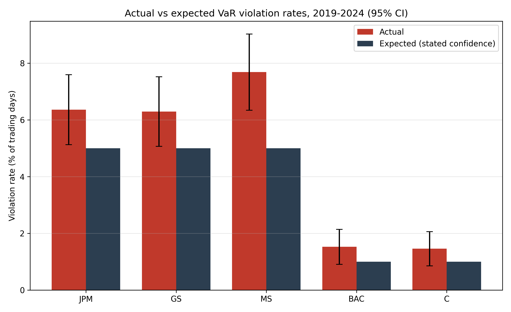
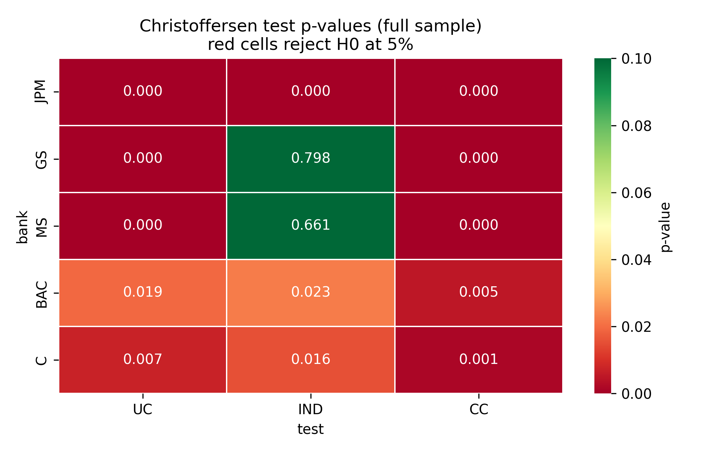
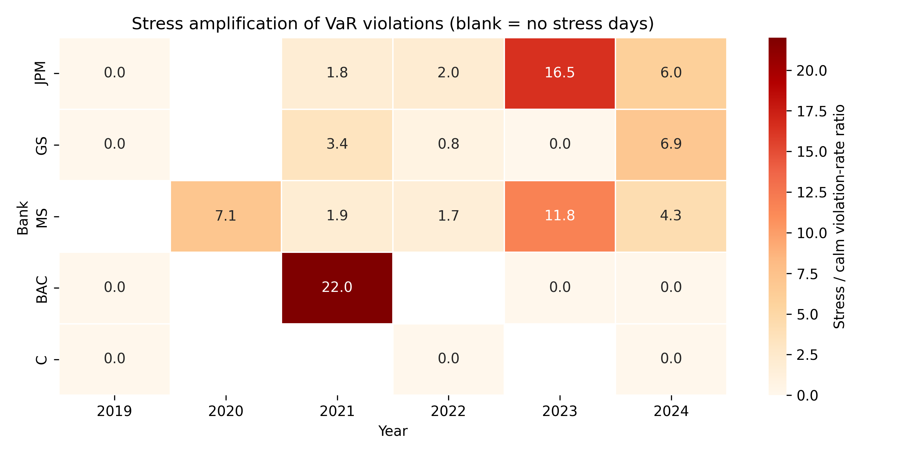

# var-confidence-audit

**Do banks' disclosed VaR figures hold up?** This project audits the one-day
trading Value-at-Risk figures that five large U.S. banks (JPM, GS, MS, BAC, C)
publicly disclose in their quarterly 10-Q and annual 10-K SEC filings against
realized daily returns over 2019–2024. It scrapes the disclosures from SEC
EDGAR, normalizes them into return space, runs the canonical Kupiec (1995)
proportion-of-failures and Christoffersen (1998) conditional-coverage
backtests across calm and stressed (VIX > 25) regimes, benchmarks the
disclosed figures against three reimplemented VaR models (historical
simulation, parametric variance–covariance, RiskMetrics EWMA), and produces an
SSRN-ready research paper PDF plus an interactive Streamlit dashboard.

## Hypothesis

Disclosed VaR is, on average, conservatively calibrated (unconditional
coverage holds), **but** violations cluster in high-volatility regimes because
quarterly-average disclosures adapt too slowly — so the Christoffersen
independence and conditional-coverage tests reject even where the Kupiec
level test does not.

## Architecture

```
                 ┌─────────────────┐      ┌──────────────────────┐
                 │  data/fetch.py  │      │ data/scrape_edgar.py │
                 │ yfinance + FRED │      │  SEC EDGAR 10-Q/10-K │
                 └────────┬────────┘      └──────────┬───────────┘
                          │     data/raw/*.csv       │
                          └───────────┬──────────────┘
                                      ▼
                     ┌────────────────────────────────┐
                     │     analysis/violations.py     │
                     │  thresholds, violation panel   │
                     └───┬──────────┬─────────────┬───┘
                         ▼          ▼             ▼
            ┌────────────────┐ ┌──────────┐ ┌──────────────┐
            │christoffersen.py│ │ kupiec.py│ │comparison.py │
            └────────┬───────┘ └────┬─────┘ └──────┬───────┘
                     │   data/processed/*.csv      │
                     └──────────┬──────────────────┘
                                ▼
                  ┌──────────────────────────┐
                  │  backtest/var_models.py  │
                  │   HS / parametric / EWMA │
                  └────────────┬─────────────┘
                               ▼
        ┌──────────────────────┴───────────────────────┐
        ▼                                              ▼
┌──────────────────────┐                    ┌────────────────────┐
│paper/generate_paper.py│                   │  dashboard/app.py  │
│ outputs/paper/*.pdf  │                    │  Streamlit, 5 tabs │
└──────────────────────┘                    └────────────────────┘
```

## Setup

```bash
git clone https://github.com/rxj0102/var-confidence-audit.git
cd var-confidence-audit
python -m venv .venv && source .venv/bin/activate
pip install -r requirements.txt
```

Create a `.env` file in the project root (optional but recommended):

```ini
# FRED API key (free at https://fred.stlouisfed.org/docs/api/api_key.html).
# If omitted, the macro context series are skipped; the core audit still runs.
FRED_API_KEY=your_key_here

# SEC requires a declared User-Agent identifying you on EDGAR requests.
SEC_USER_AGENT=your-name your-email@example.com
```

## How to run

Run the pipeline in this exact order:

```bash
python data/fetch.py            # 1. prices, returns, VIX, FRED series
python data/scrape_edgar.py     # 2. VaR disclosures from SEC EDGAR
python analysis/violations.py   # 3. violation panel + summary
python analysis/christoffersen.py  # 4. UC / IND / CC tests
python analysis/kupiec.py       # 5. POF tests + non-rejection intervals
python analysis/comparison.py   # 6. cross-bank ranking, ANOVA, stress amp.
python backtest/var_models.py   # 7. HS / parametric / EWMA reimplementation
python paper/generate_paper.py  # 8. SSRN-ready PDF + figures appendix
streamlit run dashboard/app.py  # 9. interactive dashboard
```

Or explore interactively in `notebooks/research.ipynb`.

## Key findings (placeholder — regenerate from your run)

- Unconditional coverage is broadly defensible, but **violations cluster** in
  high-VIX regimes; conditional coverage rejects for most banks.
- Stress-period violation rates are a multiple of calm-period rates.
- Daily-updating EWMA matches or beats disclosed VaR on calibration.





## Data sources

| Source | Content |
|---|---|
| [SEC EDGAR](https://www.sec.gov/edgar) | 10-Q / 10-K VaR disclosures (submissions API + full-text search) |
| [Yahoo Finance](https://finance.yahoo.com) (yfinance) | Daily adjusted close prices, VIX |
| [FRED](https://fred.stlouisfed.org) | BAMLH0A0HYM2 (HY OAS), DFEDTARU (fed funds upper bound) |

Scraping respects SEC fair-access guidance: declared User-Agent, 2-second
spacing between requests, exponential-backoff retry (max 3 attempts).

## Regulatory context

Under the Basel III internal-models approach, banks backtest one-day 99% VaR
against the last 250 days of P&L. The **traffic-light system** assigns ≤ 4
exceptions to the green zone, 5–9 to yellow (rising capital multiplier), and
≥ 10 to red (presumed model failure). That test checks only *unconditional*
coverage; this project additionally audits *independence* of violations —
the dimension on which quarterly-average disclosures are weakest.

## Caveats

Daily equity log returns proxy for (non-public) trading P&L, and disclosed
dollar VaR is normalized by a market-cap-based trading-equity assumption.
Results speak most credibly to the *dynamics* (clustering, stress
sensitivity) of disclosed VaR rather than its literal regulatory level.
Quarters whose disclosures could not be machine-read are linearly
interpolated and flagged (`interpolated_flag`).

## Citation

```bibtex
@unpublished{varconfidenceaudit2026,
  title  = {Do Banks' Disclosed VaR Figures Hold Up?
            An Empirical Audit of 10-Q Backtesting Disclosures},
  author = {[Author Name]},
  note   = {Working paper, Fox School of Business, Temple University},
  year   = {2026}
}
```

## License

MIT — see [LICENSE](LICENSE).
